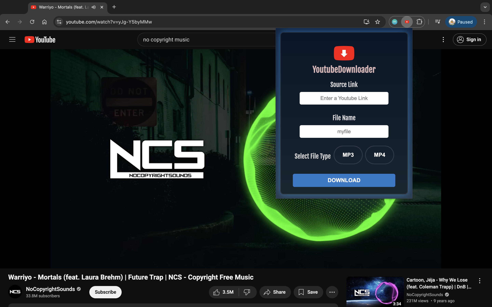

# Youtube Downloader

### Languages: HTML / CSS / Javascript / Typescript / Python
### Technologies: Git / Flask / Docker / Google Cloud Run / Live Server

A simple app for downloading Youtube Videos in MP3 and MP4 formats using the yt-dlp library (https://github.com/yt-dlp/yt-dlp). Designed with the intent to be a chrome extension. 

